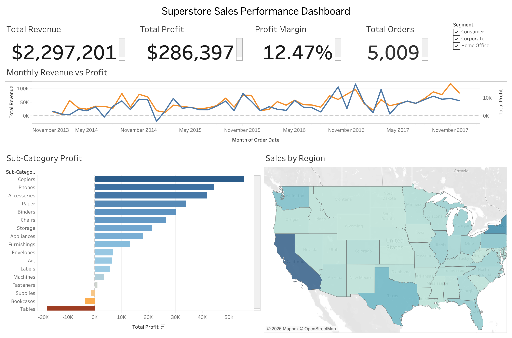

# Superstore Sales Analysis

An end-to-end sales analysis project using the Kaggle Superstore dataset, covering Excel modeling, Python data cleaning, SQL analytics, and an interactive Tableau dashboard.

## 📸 Dashboard Preview

## Project Structure
- `data/` — raw and cleaned datasets
- `excel/` — Excel pivot analysis and freight cost sensitivity model
- `notebooks/` — Python data cleaning (Jupyter)
- `sql/` — SQL analysis scripts
- `dashboards/` — Tableau dashboard and screenshot
- `docs/` — business insights summary

## Day 1: Excel Sanity Check & What-If Model
- Verified raw data: ~9,994 rows, ~$2.3M total sales
- Built pivot tables for Category → Sub-Category and Region → Ship Mode breakdowns
- Built a freight cost sensitivity model with Goal Seek to calculate the price increase needed to preserve margin under 5%, 10%, and 15% freight cost increases

## Day 2: Python Data Cleaning, Feature Engineering & SQL Analysis

**Data Cleaning (Python)**
- Loaded raw CSV with proper encoding, standardized column names
- Converted date columns to proper datetime types; verified no missing values
- Engineered two new features: `profit_margin` (profit/sales) and `shipping_days` (ship_date − order_date)
- Plotted 3-month rolling revenue trend — shows strong Q4 seasonality and consistent year-over-year growth (2014-2017)
- Exported cleaned dataset to `data/superstore_cleaned.csv`

**SQL Analysis (Core + Advanced)**
- Set up a MySQL database (`sales_db`) and loaded the cleaned dataset (9,994 rows) via `LOAD DATA LOCAL INFILE`
- Verified data integrity: total sales and profit match the Day 1 Excel baseline exactly
- **Core analysis** (`sql/01_core_analysis.sql`):
  - Monthly sales & profit trend
  - Top 10 products by profit — Canon imageCLASS 2200 Advanced Copier leads at $25.2K
  - Regional discount vs. profit — West has the lowest avg discount (10.9%) and highest profit ($108K); Central has the highest avg discount (24%) and lowest profit ($39.7K)
- **Advanced analysis** (`sql/02_advanced_analytics.sql`):
  - Month-over-month growth using `LAG()` window function
  - Customer cohort retention via CTEs — new customer acquisition has dropped sharply since 2014 (595 → 136 → 51 → 11 new customers/year), though retention of the original 2014 cohort remains strong
  - Profit leakage by sub-category — Tables and Bookcases lose money even at moderate discounts, while Binders stays highly profitable even at 37% avg discount, suggesting some categories simply can't absorb discounting the way others can
  - Exploratory: shipping speed vs. profit margin — only a mild, non-linear relationship found

## Day 3: Interactive Tableau Dashboard
- Built an executive-style dashboard in Tableau Public (`dashboards/sales_dashboard.twbx`) connected to the cleaned dataset
- **Top row:** 4 KPI cards — Total Revenue ($2.3M), Total Profit ($286K), Profit Margin (12.47%), Total Orders (5,009)
- **Middle row:** Dual-axis line chart (Monthly Revenue vs Profit, 2014-2017) + filled map (Sales by State, shaded by revenue)
- **Bottom row:** Sub-Category Profit bar chart with diverging red/blue conditional coloring — visually confirms Tables and Bookcases as the only loss-making sub-categories — plus a live Segment filter (Consumer/Corporate/Home Office)
- Static export saved as `dashboards/dashboard_screenshot.png`

## 🔑 Key Findings

- Regional discounting strongly affects profitability: West (10.9% avg discount) generates $108K profit vs. Central (24% avg discount) at just $39.7K
- Tables and Bookcases are the only net-loss sub-categories (-$17.7K and -$3.5K), while Binders stays profitable ($30.2K) even at a 37% avg discount — proving discount level alone doesn't predict loss
- A 10% freight cost increase would erase 80% of current profit without an 11.32% price adjustment (Excel Goal Seek model)
- Revenue shows consistent Q4 seasonality and year-over-year growth (2014-2017)
- New customer acquisition has dropped sharply (595 → 136 → 51 → 11 new customers/year) while retention of existing customers remains strong

## 💡 Recommendations

- Cap discounts on Tables and Bookcases at 15% to eliminate their combined -$21.2K annual loss
- Build a freight-cost monitoring trigger tied to proactive price adjustments
- Increase inventory/staffing ahead of Q4, starting in September
- Investigate the new-customer acquisition decline — retention is strong, so acquisition is the higher-leverage fix

*(Full detail in [`docs/business_insights_summary.md`](docs/business_insights_summary.md))*

## Status
✅ Complete — Excel modeling, Python cleaning, SQL analysis, Tableau dashboard, and business insights all delivered.